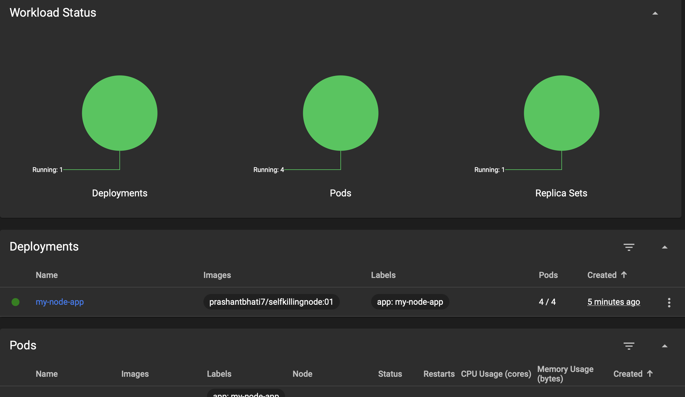
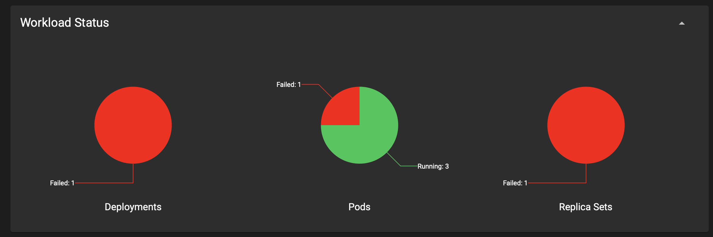
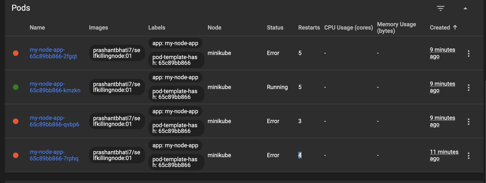

# overview 
    this node application stops the server (i.e kill the running process) when we req on /stop
    this is to test the self healing of k8s , how it works 

## steps 

1) push the image to dockerhub 
2) run following commands on terminal 
 ```  
  kubectl create deployment my-node-app --image=prashantbhati7/selfkillingnode:01
  kubectl get deployment
  kubectl get pods

  
   kubectl expose deployment my-node-app  --port=3000 --type=LoadBalancer
   minikube service my-node-app

   minikube dashboard
 ```

 ## observation 
  you will notice that on hitting /stop the process stop pod stops and retries again and the container got up and running again without any manual intervention , that's becasuse kubernetes is self healing.
  
  ### but you will notice that there is still some downtime as there is only one pod running and that to got stopped and restartin takes time so our app is not always available 

# Solution -> for downtime 
## scaling 
  what if we increase the pods/replicas of our container image ? 
  if one got stop other are till available and untill the previous one restarts others will handle the requests 
  also when we have high traffic we can handle more number of users by load balancing b/w the pods.

### command to scale (same command can be used to scale up and down as well)
``` 

give no of replicas required to scale up or down 
for scale up - give no of replicas more than now 
for scale down - give no of replicas less than now 

kubectl scale --replicas=<no-of-replica> <replicaionSet/replicationController>
or 
kubectl scale deployment <deploymwent-name> --replicas=<number-of-replicas>

```

# how this works pictures 





